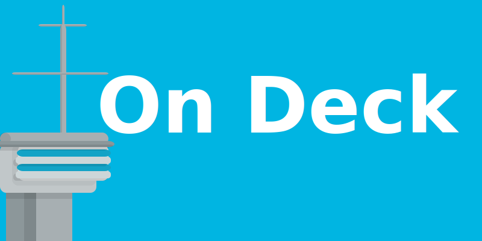

# On Deck

<!-- ## Purpose -->
<!-- This project started-out as a portfolio project and exploration of what full-stack web Rust development would feel like for someone who was completely brand-new to it. I surely did attempt to escape tutorial-hell with this one. The web-game implements Rocket for handling server requests and managing the Redis database. The web-frontend subsists solely off yew along side some web_sys function calls. All assets see within the game were created from svg files as well as normal CSS animations. -->

